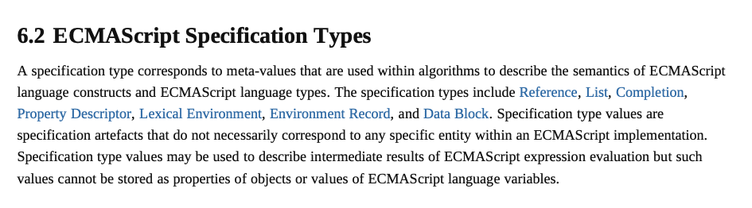
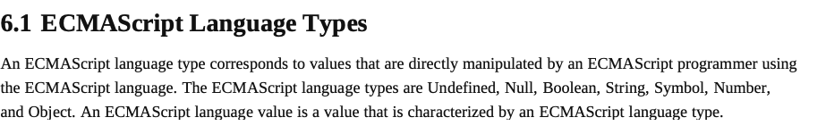

# 第一周

## 编写一个 DOM 编辑器：可以自由地操作一个 iframe（空白）中的 DOM 结构，包括增、删、移动

```javascript

const iframDomEditor = () => {
  // all safte tags
  const tagsList = [
    'head','title','base','link','meta','style','body','article','section','nav','aside','h1','h2','h3',
    'h4','h5','h6','hgroup','header','footer','address','p','hr','pre','blockquote','ol','ul','menu',
    'li','dl','dt','dd','figure','figcaption','main','div','a','em','strong','small','s','cite','q',
    'dfn','abbr','ruby','rt','rp','data','time','code','var','samp','kbd','sub','sup','i','b','u','mark',
    'bdi','bdo','span','br','wbr','a','area','ins','del','picture','source','img','iframe','embed',
    'object','param','video','audio','track','map','area','table','caption','colgroup','col','tbody',
    'thead','tfoot','tr','td','th','form','label','input','button','select','datalist','optgroup',
    'option','textarea','output','progress','meter','fieldset','legend','details','summary','dialog',
    'script','noscript','template','slot','canvas'
  ];
  // get base item
  const iframes = document.getElementsByTagName('iframe');
  const curDocument = iframes.contentDocument || iframes.contentWindow.document;
  // addAttribute
  const addAttributes = (attribute, dom) => {
    if(dom){
      if(Object.keys(attribute).length > 0){
        Object.keys(attribute).map((i) => newDom.setAttribute(i, attribute[i]))
      }
    }
    return void 0;
  }
  //  create
  const createDom = ({
    elementType,
    attribute
  }) => {
    const newDom = document.createElement(elementType);
    addAttributes(attribute, newDom);
    return newDom
  }
  // add
  const addDom = ({
    elementType,
    attribute
  }) => {
    if(elementType && tagsList.includes(elementType)){
      const newDom = createDom({ elementType, attribute })
      iframes.appendChild(newDom)
    }
    return void 0;
  }
  // delete
  // key: name, css, documentType
  const deleteDom = ({ key, value }) => {
    if(key && value){
      const localElemt = searchDom({ key, value });
      if(localElemt){
        localElemt.parentNode.removeChild(localElemt);
      }
    }
    return void 0;
  }
  // replace
  // key: name, css, documentType
  const replaceDom = ({ key, elementType, attribute }) => {
    if(key && value){
      let localElemt = searchDom({ key, value });
      if(localElemt){
        // deal with the condition which the elementType same but attributes different
        if(elementType && localElemt.tagName.toLowerCase() !== elementType.toLowerCase()){
          localElemt.replaceWith(createDom({ elementType, attribute }));
        }else {
          addAttributes(attribute, localElemt);
        }
      }
    }
    return void 0;
  }
  // search
  // key: name, css【css means querySelector】, documentType, all
  // if key === css
  // value must obey the rule https://developer.mozilla.org/en-US/docs/Web/API/ParentNode/querySelector#Escaping_special_characters
  const searchDom = ({ key, value }) => {
    if(value) {
      try {
        switch (key) {
          case 'name':
            return curDocument.getElementsByName(value);
          case 'css':
            return document.querySelector(value);
          case 'documentType':
            return curDocument.getElementsByTagName(value);
          default:
            break;
        }
      } catch(e) {
        console.log('searchDom params entry value is error: ', e);
      }
    }
    return void 0;
  }

  return {
    add: addDom,
    del: deleteDom,
    replace: replaceDom,
    search: searchDom,
  }
}

!(function() {
  window.iframEditorInstance = iframDomEditor()
  }
})(window);

```

## position float display 各有哪些取值，它们互相之间会如何影响

```javascript
position: absolute | relative | static | fixed | sticky | unset | initial | inherit
float: none | left | right | unset | initial | inherit
display: inline | block | flex | table | grid | inline-block | inline-flex ...
互相之间会如何影响: 太多啦
```

## HTML 的中，如何写一个值为 "a"="b" 的属性值？
```javascript
// first way
elementObject.setAttribute('data', `"a"='b'`)
// second way
elementObject.setAttribute('data', "\"a\"=\"b\"")
```

## 编写一个快速排序代码，并且用动画演示它的过程，快速排序动画
> Chinglish 练习中 😜

```javascript

function quickSort(arr, left, right) {
  let i = left;
  let j = right;
  let key = arr[left]; //Basic comparison object
  if(left >= right){ // deal with the array length === 1
    return;
  }
  while(i < j){
    while(arr[j] > key && i < j){
      // find the first number which less than key
      // or left sign equals right's
      // then break loop
      j--;
    }
    while(arr[i] <= key && i < j){
      i++;
    }
    if(i < j){
      // swap location
      let temp = arr[i];
      arr[i] = arr[j];
      arr[j] = temp;

    }
  }

  arr[left] = arr[i]
  arr[i] = key;
  // find by left
  quick_sort(arr, left, i-1);
  // find by right
  quick_sort(arr, i+1, right);
  return arr
}

```

> 动画思路

* 将快排中的每次移动结果进行记录（当前移动的元素和起位置）
* setTimeout 1500 的频率 更新 dom

## All HTML Entity
[all Entity](./Entity.txt)


## ECMAScript Specification Types

> The specification types include Reference, List, Completion, Property Descriptor, Lexical Environment, Environment Record, and Data Block.
© Ecma International 2019  p43

## ECMAScript Language Types

> The ECMAScript language types are Undefined, Null, Boolean, String, Symbol, Number, and Object.
© Ecma International 2019 p25
