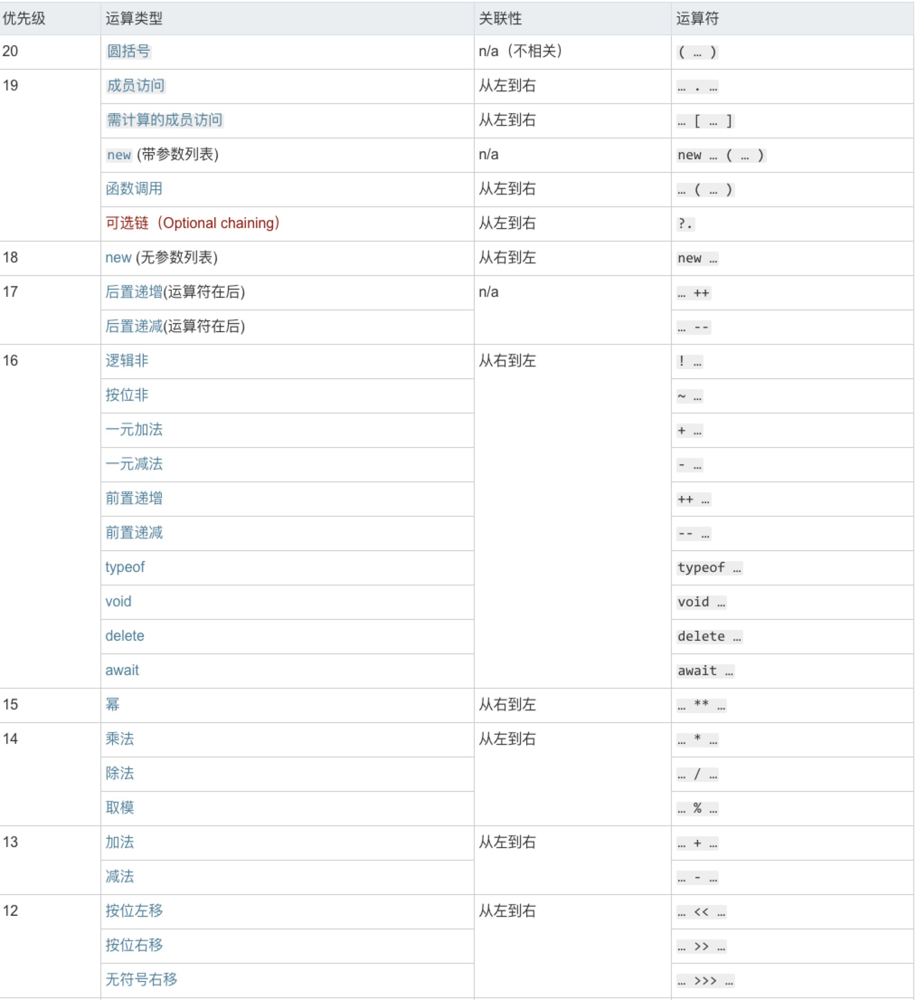
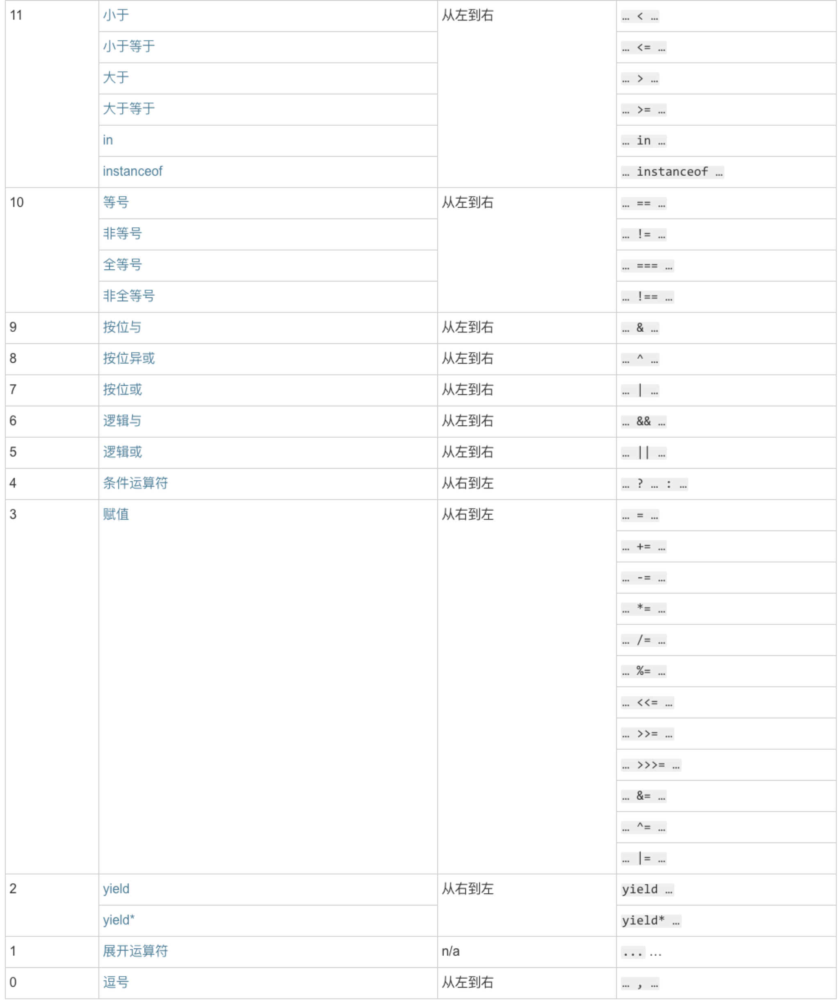

# Third Weekly Summary

* 重新梳理的对符号优先级的认识
  * 
  * 
  * [link](https://developer.mozilla.org/zh-CN/docs/Web/JavaScript/Reference/Operators/Operator_Precedence)

* 对generator有了新的了解。Generator并不是async的语法糖

* generator是结构化编程的产物

* 上下文是指变量在内存中所在地址(属于动态概念)

* 作用域是指声明所在的文本范围(静态代码中的文本内容)

* var不受Block级作用域影响，且JS中var有预处理机制

* 只有 continue 和 break 会消费labelStatement(即跳转到对应label处)

---
[本周总结脑图](./week3.png)

---
[JS标准中那些无法实现的对象](./ExoticObjects.md)
