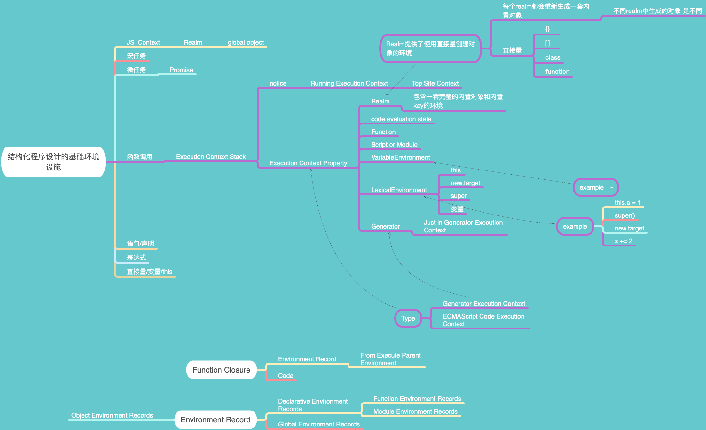

# 第五周总结

### 函数调用

* ***执行栈(Execution Context Stack)*** 用于存放不同函数执行时上下文信息的 **数据结构(栈结构)**
  * 每个函数都有一个属于自身的 ***执行上下文(Execution Context)***
  * 函数调用(即进入函数式)时会自动 **push** 执行上下文进入 **执行栈**
  * 函数调用结束时会自动对**执行栈** 执行 **pop**  
  * 位于执行栈 **栈顶** 的元素,称为Running Execution Context
* ***Execution Context*** 执行上下文
  * __code evaluation state__: 用于存放 ___async___、___generator___ 函数对应的位置
  * __Function__: 如果是全局的script的话, 这里会是null
  * __Script or Module__: 如果是当前函数是来自于非script or module的话，这里也会是null
  * ?___Generator___: 只有由generator产生的函数才会有这个属性
  * ___Realm___
  * ___LexicalEnvironment___: 词法环境,取变量值时所需要的环境
    * this
    * new.target
    * super
    * 变量
  * ___VariableEnvironment___: 变量环境,仅仅用于处理var 声明

### 模拟实现浏览器的http通讯
参考文档：[rfc7231](https://tools.ietf.org/html/rfc7231#section-6.5.1)
#### Server
* 服务端
  * 使用 **NodeJS** 作为 **Web Application Server**
  * 使用 **http** 模块创建服务 _(http.createServer)_
  * 服务需要监听对应端口 ***server.listen(port)***

#### Client
* 客户端
  * 使用 **NodeJS** 的 **net** 模块创建http请求client
* Request
  * 请求行: Request-Line
  * 请求头: Request-header
  * 请求实体: meesage-body-entity
```javascript
Constructor

Request = Request-Line
         *( general-header;
          | request-header;
          | entity-header; )
          CRLF
          [ message-body ]
```        
参考文档：[rfc2068](https://tools.ietf.org/html/rfc2068#page-37)
```javascript
Request

METHOD: GET | POST | PUT | DELETE | OPTIONS | HEAD | TRACE | CONNECT
PATH: URL PATH PART
VERSION: 1.0 | 1.1 | 2.0
HOST: Request Origin Address
CONNECTION: Connection | Keep-Alive | Proxy-Authenticate | Proxy-Authenrization | Trailer | TE | Tranfer-Encoding | Upgrade
(设定 以上 8 个 value时, 整个 header属于 Hop-by-hop Headers; 使用其他value时，则是 End-to-end Header)
USER-AGENT: Client Info
ACCEPT: Response body format
CACHE-CONTROL: CACHE EXPIRATION TIMES

----request line----
METHOD PATH HTTP/VERSION
----request line end----
----headers----
HOST: xxxx
CONNECTION: keep-alive
USER-AGENT: Mozilla/5.0 (Macintosh; Intel Mac OS X 10.9; rv:50.0) Gecko/20100101 Firefox/50.0
ACCEPT: text/html
CACHE-CONTROL: max-age=0
----headers end----
/r/n
----body----
xxxx=xxxx
----body end----

```
* Response
  * 状态行
    * 响应协议
      * eg: HTTP/1.1 HTTP/2.0
    * 响应状态
      * 信息类: Informational responses (100–199)

      > 该类别指示临时用于传达连接状态或请求进度的响应
      > 在完成请求的操作并发送最终结果之前响应

      * 请求成功类: Successful responses (200–299),
      * 重定向类: Redirects (300–399),
      * 客户端错误: Client errors (400–499),
      * 服务端错误: Server errors (500–599).
      * [标准初次定义于rfc2616](https://tools.ietf.org/html/rfc2616#section-10)
      * [状态码扩展于rfc7231](https://tools.ietf.org/html/rfc7231#section-6.5.1)
  * 响应头
  * 响应实体: meesage-body-entity

```javascript
Constructor

Response = Status-Line;
          *( general-header;
            | response-header;
            | entity-header );
            CRLF
            [ message-body ];
```

```javascript
----status line----
HTTP/1.1 200 OK
----status line end----
----headers----
COntent-Type: text/html
Date: Mon, 23 Dec 2019 06:46:19 GMT
Connection: keey-alive
Transfer-Encoding: chunked
----headers end----
/r/n
/r/n
----body----
start with: text.length, type is number
text
end with: 0
----body end----
```
> HTTP 1.0 是没有定义1xx范围内的响应码的

### 脑图记录

