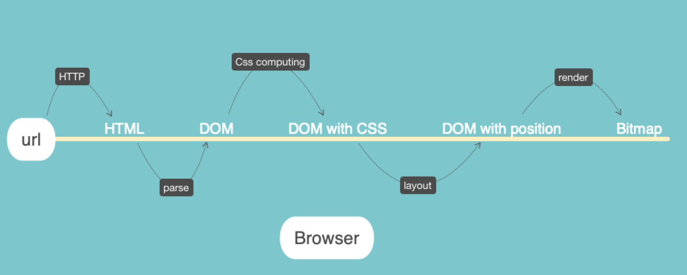

# 第六周总结

## Finite State Machine

### if else 转 function

* main
```JavaScript
function stateMachine(target) {
  // 定义开始状态 start
  let state = start;
  for(let obj of target){
    // 通过固定的 input(obj), 让每个转态机来决定下次的状态迁移
    state = state(obj);
  }
  // 定义终止状态end
  return state === end;
}
```
* machines
```JavaScript
function start(input) {
  let conditon = true;
  if(conditon){
    return next1;
  }
  // conditon with input
  return start;
}

...

function next1() {

}

...

function nextN() {
  let conditon = true;
  if(conditon){
    return end;
  }
  // conditon with input
  return start;
}

...

function end(input) {
  return end;
}

```
[example](./conditionToFunction.js)

### How Browser Render


### HTML Parser

* 解析规则
> [HTML Parser State Machine Definition](https://html.spec.whatwg.org/multipage/parsing.html#tokenization)


### CSS Parser
#### 解析规则
> [CSS Parser Definition](https://www.w3.org/TR/CSS21/grammar.html)
* 主要思路：***每次标签close时，对当前标签范围内的所有element进行分析，并添加css属性***
* 逻辑
  * 收集CSS规则
    * 解析html时,遇到style标签时,将其中的css 规则保存
    * 调用 css parser 分析 css 并生成 ast
  * 添加调用
  * 获取父元素序列
    * computeCss：根据当前元素的父元素，才能判断元素是否与规则匹配
    * 从 document 中获取当前元素的所有父元素
    * 匹配顺序：从内向外。因为 当前首先获取的是当前元素
  * 拆分选择器
    * 选择器为了和父元素的内容匹配，也需要翻转成从内向外
    * 复杂选择器拆成针对单个元素的选择器, 用对比循环的方式进行匹配
      * 当出现多个style sheet 作用于同一个tag时,需要按照[Cascade Rules](https://www.w3.org/TR/CSS2/cascade.html#specificity)进行样式合并
##### 样式权重
[A declaration in the 'STYLE' attribute of an element (see section 1.1 for an example) has the same weight as a declaration with an ID-based selector that is specified at the end of the style shee](https://www.w3.org/TR/CSS1/#cascading-order)

> 注意： __CSS 1.0 中inline style 和 id selector 的权重是一样的,直到2.0时，才在文档中被区分开__

### 概念
* 重排 reflow

* 重绘 repaint
  * 解析html, 当完成style标签部分的解析时, 浏览器会进行重绘
  * css回溯: 当body中存在style时

* CSS Trigger
> [各属性对重排、重绘和CSS Composite的影响](https://csstriggers.com/)
#### 注意
* css重新计算一定造成重排，重排一定造成重绘
