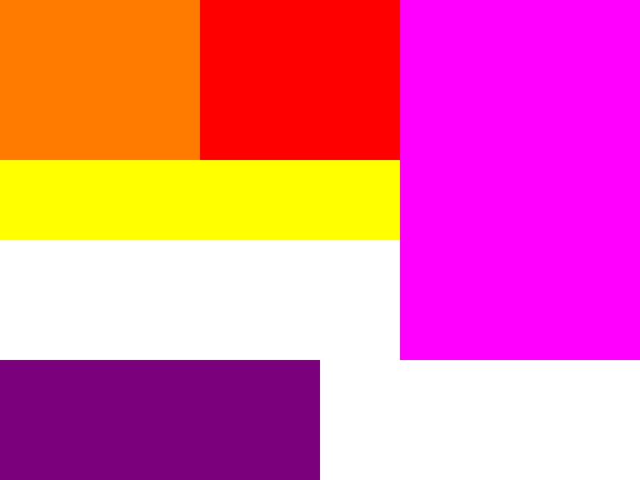

### 课后作业：

> 通过完成 layout 计算和使用图形库, 完成 toy-browser

#### code
- [Layout](./net/js/layout.js)

#### result

> 画一个 CSS 的脑图

#### Preview

- [MindNode](./reLearnCSS.mindnode)

#### 跟着课程跑一跑两个小实验程序

> 获取w3c所有css相关文档及其链接

- [getCSSDocument](./collect/getCSSDocument.js)

- [Result](./collect/cssDocument.json)

> spider tool

- [getDefPropDef](./collect/getDefPropDef.js)
