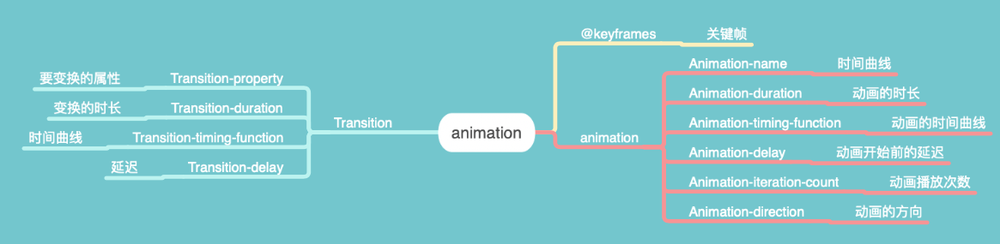

# 第九周总结

### CSS Animation

#### Animation 组成

#### 贝塞尔曲线

##### 一次贝塞尔曲线

##### 二次贝塞尔曲线

##### 三次贝塞尔曲线
> 在线效果演示 https://cubic-bezier.com/#.17,.67,.83,.67

### Semantics in HTML 5

Semantic HTML or semantic markup is HTML that introduces meaning to the web page rather than just presentation.

|  标签   | 说明  |
|  ----  | ----  |
| aside  | 导航性质的工具内容 |
| article  | 具有明确的独立性的内容 |
| hgroup  | 标题组 |
| abbr  | 当前内容为缩写 |
| hr  | 表示故事走向的转变或者话题的转变 |
| p  | 普通的段落 |
| strong  | 表示重要性 |
| blockquote  | 表示段落级引述内容 |
| q | 表示行内的引述内容 |
| cite  | 表示引述的作品名 |
| time  | 表示时间 |
| figure  | 表示与主文章相关的图像、照片等流内容 |
| figcaption  | 表示具有一定自包含性（类似独立句子）的内容 |
| dfn  | 包裹被定义的名词 |
| nav  | 包裹章节目录 |
| pre  | 表示这部分内容是预先排版过的，不需要浏览器进行排版 |
| samp  | 表示计算机程序的示例输出 |
| code  | 表示代码 |
| aside  | 导航性质的工具内容 |
| small  | 单元格 |
| s  | 单元格 |
| i  | 单元格 |
| b  | 单元格 |
| u  | 单元格 |
| data  | 单元格 |
| var  | 单元格 |
| kbd  | 单元格 |
| sub  | 单元格 |
| sup  | 单元格 |
| bdi,bdo  | 单元格 |
| mark  | 单元格 |
| wbr  | 单元格 |
| menu  | 单元格 |
| dl,dd,dt  | 单元格 |
| main  | 单元格 |
