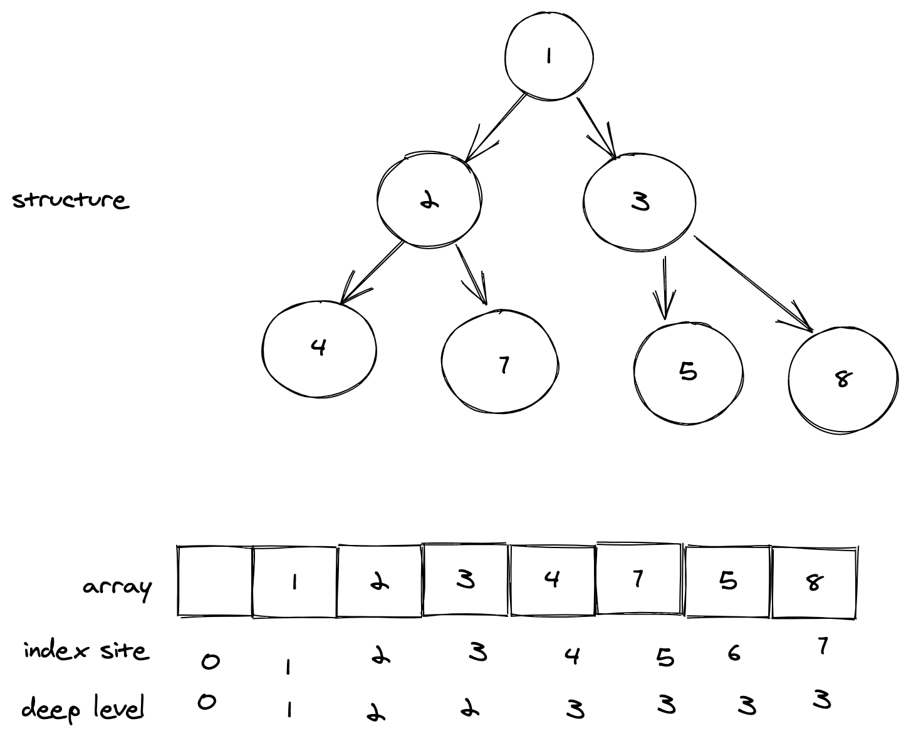

# 每周总结可以写在这里

## BinaryHeap
> 二叉堆(binary heap)是一种通常用于实现优先队列的数据结构
### 什么是堆
* 堆是一个完全二叉树
* 堆中每一个节点的值都必须大于等于（或小于等于）其左右子节点的值

### 结构性
> 二叉堆是一颗除底层外被完全填满的二叉树

* 一颗高为h的二叉堆有2<sup>h</sup>到2<sup>h+1</sup>-1个结点

#### 对于数组中任一位置i上的元素
  * 它的左儿子节点位于2i
  * 它的右儿子节点位于2i+1
  * 它的父亲节点位于i/2

#### 基于结构的特性


可以使用一个数组表示这种数据结构
#### 堆序性
##### 大顶堆(max-heap)
每个节点的值都大于等于其左右节点的堆
其顶部是值最大节点
##### 小顶堆(min-heap)
每个节点的值都小于等于其左右节点的堆
其顶部是值最小节点

### 堆操作
> 堆化（heapify）: 顺着节点所在路径，向上或者向下，对比，交换。

往堆中插入一个元素后，我们需要继续满足堆的结构性和堆序性。
为了重新满足堆的特性，需要对堆进行调整。调整的过程，称之为堆化。

* 从下往上(插入元素):
  让新插入的节点与父节点对比大小。如果不满足子节点小于等于父节点的大小关系，就互换两个节点。一直重复这个过程，直到父子节点之间满足刚说的那种大小关系。
  * 会出现数组空洞
* 从上往下(删除堆顶元素):
  把最后一个节点放到堆顶，然后利用同样的父子节点对比方法。对于不满足父子节点大小关系的，互换两个节点，并且重复进行这个过程，直到父子节点之间满足大小关系为止。

```javascript

class BinaryHeap {
  data = []; // 数组，从下标1开始存储数据
  compare = null; // 比较函数

  constructor(data, compare) {
    this.data = data;
    this.compare = compare;
  }

  swap(i, p, v) {
    temp = v;
    if(typeof v === 'undefined'){
      temp = this.data[i];
    }
    this.data[i] = this.data[p];
    this.data[p] = temp;
  }

  insert(v) {
    this.insertAt(this.data.length, v)
  }

  insertAt(i, v) {
    this.data[i] = v;
    while (i > 0 && this.compare(v, this.data[Math.floor((i - 1) / 2)])) {
      this.swap(i, Math.floor((i - 1) / 2));
      i = Math.floor((i - 1) / 2);
    }
  }

  
removeTop() {
  if (this.data.length == 0) return; // 堆中没有数据
  this.data[0] = this.data[this.length - 1];
  this.data.pop();
  this.heapify();
}

heapify() { // 自上往下堆化
  let i = 1;
  while (true) {
    let position = i;
    if (i*2 <= n && this.data[i] < this.data[i*2]) {
      position = i*2;
    }
    if (i*2+1 <= n && this.data[position] < this.data[i*2+1]) {
      position = i*2+1;
    }
    if (position == i) {
      break;
    }
    swap(i, position);
    i = position;
  }
}

  get length() {
    return this.data.length;
  }
 }
```