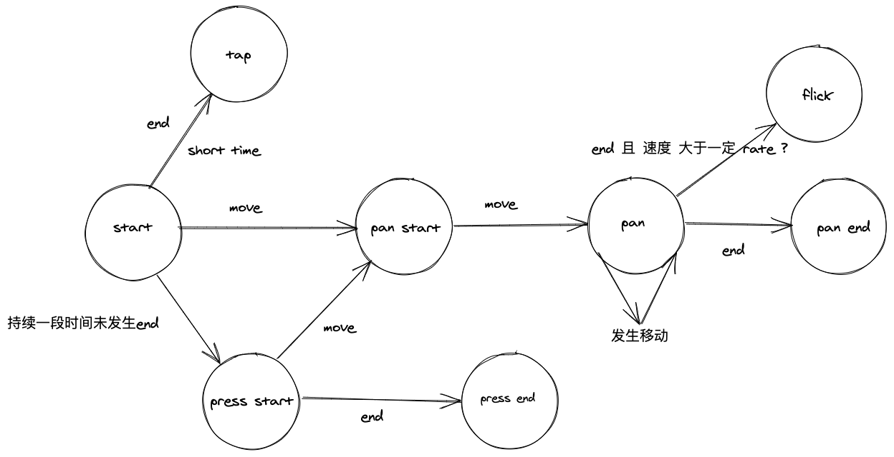

# 每周总结可以写在这里

## Gesture
> 手势库

### touch 系列事件
#### 事件
* touchstart
* touchmove
* touchend
* touchcancel(eg: 弹出弹框阻断touch时)
> 其中 touchend 和 touchcancel，两者必定会触发其中的一个事件
#### changedTouches
是一个包含了 所有触控点信息的 List（即设计时即支持多指操作）
```JavaScript
interface Touch {
  readonly    attribute long        identifier;
  readonly    attribute EventTarget target;
  readonly    attribute long        screenX;
  readonly    attribute long        screenY;
  readonly    attribute long        clientX;
  readonly    attribute long        clientY;
  readonly    attribute long        pageX;
  readonly    attribute long        pageY;
}
interface TouchList {
    readonly    attribute unsigned long length;
    getter Touch? item (unsigned long index);
};
```
### 事件定义

* Tap
  * 点击
* Pan
  * 拖拽
* Flick
  * 快速滑动
* Press
  * 按压



### mouse 与 touch 事件 进行统一抽象

基础行为抽象为：
* start
* move
* end
* cancel

流程：
* 开始点击，即视为 tap
* 当开始点击后，一定时间内未触发move，即视为 start press，触发 pressstart 事件（使用 setTimeout 进行计时修改）
* 触发move时，当移动距离 大于 一定程度时 且 当前状态不为 pan，视为 start pan，触发 panstart 事件
* 触发结束时，并清除 setTimeout
  * 行为未改变，即为 tap 事件;
  * 当前状态为 pan时
    * 移动速度大于一定值时， 触发 flick 事件;
    * 移动速度小于一定值时， 触发 panend 事件;
  * 当前状态为 press 时，触发 pressend 事件;

### 注意点
* 定义 ***contexts*** 用于记录鼠标 或者 触控时的移动距离 （_因为 触控时存在 **多指触控** 行为_）
* 通过 symbol 定义 mouse 专用标识，区分 touch 与 mouse 的事件记录
* mousedown 与 touchstart 是开始记录
* touchend 与 touchcancel 时删除对应 触控点的记录

### 双端兼容

移动端浏览器是默认开启鼠标和触控事件的，所以 移动端时主动关闭鼠标事件。
ontouchstart 在PC端默认是undefined, 在移动端默认是null

### CustomEvent

[CustomEvent](https://developer.mozilla.org/en-US/docs/Web/API/CustomEvent/CustomEvent) 中自定义依赖值的方式:
* 依赖值声明在「customEventInit」的 detail 对象中
> 如果直接放入 customEventInit 部分，自定义事件中将无法获取声明的依赖
* 通过 Object.assign 对 自定义事件的 prototype 扩增

## Animation

CSS  直接通过 非 matrix 修改 transform 无法实现 停止效果，但是 通过 返回 matrix 内容则是可以的

matrix = ( rotate, scale, translate, skew )

当 skew 不存在时，可以反解 出 matrix 原来的内容；反之则无法解析

## TimeLine 优化

将 animations 改为 Set 存储
增加 记录完成当前动画的 finishedAnimations Set
增加 记录当前动画开始时间的 addTimes Set

## VDOM 中 动画效果实践
思路一:

* 将 style 视为 组件的 state. 通过 setState 触发属性更新
  * 实现难点：让组件 支持 setState 方法
------
思路二:
* 让组件库原生 支持 animation
  * 给每个需要 支持 Gesture 的组件添加监听事件，通过劫持的对象内存地址，进行实时变更动画
  * 实现难点：子组件上不存在 实际 DOM. 然而 animation库中则是 对 DOM 中 CSSOM 的修改
  * 实现方向:
    * 一：通过组件 _根节点_ 的 **「VDOM」** 获取最终渲染的实例 **「DOM」** 。根据 **「子节点」**  位置信息来获取 ___待劫持___ 的 **CSSOM** 对象
    * 二：通过给每个VDOM子节点添加自身DOM的属性，最终 通过子组件集合，获取每一个的待更新的DOM来劫持CSSOM
