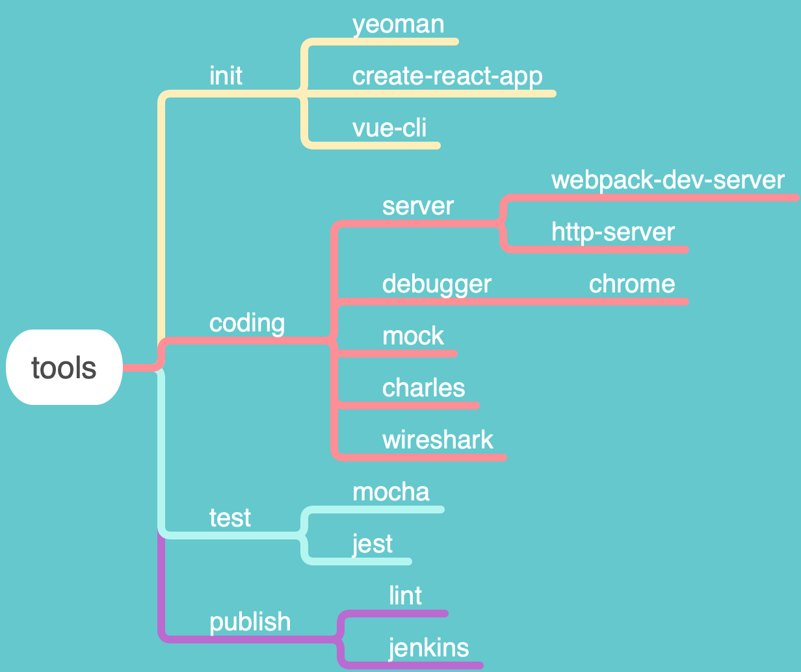

# 每周总结可以写在这里

## 匿名函数递归 
> Y Combinator

The Y Combinator explained with JavaScript
view sourceprint?
```code
--- es5 ---
var y = function(le) {
    return function(f) {
        return f(f);
    }(function(f) {
        return le(
            function(x) { return (f(f))(x); }
        );
  });
};
or
--- es6 ---
//yc here
var y = g => 
    (f=>f(f))(
        self => 
            g( (...args)=>self(self)(...args) ) 
    )

// 使匿名函数递归
var f = y(self =>
    n => n < 0 ? 0 : n + self(n-1))
```
[YCombinatorExplained](http://kestas.kuliukas.com/YCombinatorExplained/)

## 工程化



### 工具链

#### Yeoman
> Yeoman是现代化前端项目的脚手架工具，用于生成包含指定框架结构的工程化目录结构。

Step:

* 全局安装 yo
```
npm install -g yo
```
or
```
yarn global add yo
```
* 创建自定义工具工程
  * 需要以 generator 开头
  * 安装依赖
```
  npm install yeoman-generator
```
or
```
  yarn add yeoman-generator
```
* 创建工程结构
  * generator
    * app
      * index.js
* 集成并实现 generator
```
  var Generator = require("yeoman-generator");

module.exports = class extends Generator {
  flow steps
  // 处理 自动运行的流程
}
```
