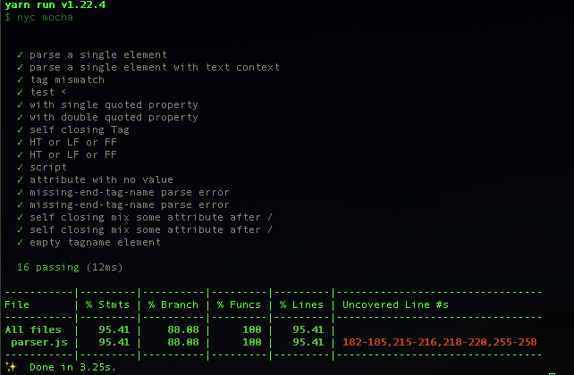

### 课后作业：

> 跟上课程进度，将 parser.js 的 test case 补充完整，并将它的 coverage 做到 90 以上

#### mocha
- [mocha-demo](./mocha-demo)

#### html-parser

[html-parser](./html-parser)

result:

todo:
补充剩余 EOF 相关分支的 test case